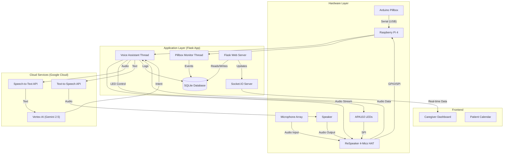

# IoT Medication Manager

A smart, voice-activated medication management system designed to help patients adhere to their medication schedules. This project integrates a **Raspberry Pi** with a **ReSpeaker 2-Mics Pi HAT**, an **Arduino-controlled smart pillbox**, and **Google Cloud AI services** to provide a seamless assistive experience.

## System Overview

The IoT Medication Manager combines:
1.  **Voice Assistant**: Reminds patients to take medication and understands natural language responses using **Google Gemini 2.5 Flash**.
2.  **Smart Pillbox**: Detects physical compartment openings via an Arduino interface to automatically log medication intake.
3.  **Caregiver Dashboard**: A real-time web interface for caregivers to monitor patient status and receive alerts.

## Architecture

The system follows a hybrid architecture combining local embedded control with cloud-based AI.



## Hardware Requirements

*   **Raspberry Pi 4** (or 3B+)
*   **ReSpeaker 2-Mics Pi HAT** (for Audio Input & LED feedback)
*   **Arduino Uno/Nano** (for Pillbox sensor control)
*   **Speaker** (3.5mm jack connected to ReSpeaker HAT)
*   **Magnetic Reed Switches** (for detecting pillbox compartment status)

## Software Requirements

*   **Python 3.11+**
*   **Google Cloud Platform Account** with enabled APIs:
    *   Cloud Speech-to-Text API
    *   Cloud Text-to-Speech API
    *   Vertex AI API

## Installation & Reimplementation

Follow these steps to set up the system from scratch.

### 1. Clone the Repository
```bash
git clone https://github.com/jovalie/IoT-Medication-Manager.git
cd IoT-Medication-Manager
```

### 2. System Dependencies (Raspberry Pi)
Install the necessary system libraries for audio and GPIO control.
```bash
sudo apt-get update
sudo apt-get install portaudio19-dev python3-pyaudio libatlas-base-dev
```

### 3. Python Environment
Create and activate a virtual environment.
```bash
python3 -m venv venv
source venv/bin/activate
pip install -r requirements.txt
```

### 4. Google Cloud Setup
1.  Create a **Service Account** in the Google Cloud Console.
2.  Grant the service account the **Vertex AI User** role.
3.  Download the JSON key file.
4.  Rename it to `google_credentials.json` and place it in the project root directory.

### 5. Hardware Setup
1.  Mount the **ReSpeaker 2-Mics Pi HAT** onto the Raspberry Pi GPIO pins.
2.  Connect the **Speaker** to the HAT's 3.5mm audio jack.
3.  Connect the **Arduino** to the Raspberry Pi via USB.
    *   Ensure the Arduino is running the `pill_box.ino` sketch.
    *   Verify the serial port is `/dev/ttyACM0` (or update `SERIAL_PORT` in `app.py`).

### 6. Arduino Pillbox Logic (`arduino/pill_box.ino`)

The smart pillbox uses an Arduino to monitor 7 compartments (Monday-Sunday) using magnetic reed switches.

*   **Pin Configuration:**
    *   Pins 2-8: Reed Switches (Input Pullup) for Mon-Sun.
    *   Pin 13: Status LED (Lights up when a box is open).
*   **Logic:**
    *   The loop checks the state of all 7 switches continuously.
    *   When a compartment is opened (Magnet moves away -> Switch HIGH), it sends a serial message: `OPENEVENT:<Day>` (e.g., `OPENEVENT:Mon`).
    *   This message is intercepted by the Python application (`monitor_pillbox` thread) to log the medication intake.
    *   It also tracks the duration the box remains open to validate "real" usage vs accidental triggers (though the primary trigger for the app is the initial open event).

## Usage

### Run the Application
To start the full system (Voice Assistant + Web Server + Pillbox Monitor):

```bash
python3 app.py
```

*   **Web Dashboard:** Access at `http://<RPi_IP_Address>:8080/caregiver`
*   **Voice Assistant:** Follow the console prompts. Press **ENTER** to start the demo flow for each patient.

### Run in "No-Pi" Mode (Local Testing)
If you don't have the specific hardware (ReSpeaker/Arduino) and want to test the logic/web interface on a laptop:

```bash
python3 app.py --no-pi
```
*   Uses your computer's default microphone/speaker.
*   Simulates LED behavior in the console.
*   Skips Arduino serial connection.

## Demo Scenarios

The system is pre-configured with 4 personas to demonstrate different capabilities:

1.  **Student Hamad**: Takes medication immediately via the pillbox (No voice interaction needed).
2.  **Athlete Joan**: Asks for a delay ("5 more minutes"), then takes medication via the pillbox.
3.  **Uncle Sam**: Misses medication completely (Demonstrates silence detection, retries, and alerts).
4.  **Grandpa Albert**: Delays repeatedly until max retries are reached, triggering a caregiver alert.

## Project Structure

*   `app.py`: Main application entry point (Flask + Voice Logic).
*   `pill_box.ino`: Arduino sketch for the smart pillbox.
*   `interfaces/`: Hardware interface modules (LEDs, etc.).
*   `templates/`: HTML templates for the web dashboard.
*   `SYSTEM_DESIGN.md`: Detailed system architecture documentation.

## Gallery


